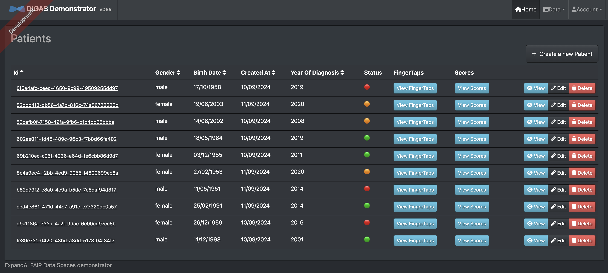
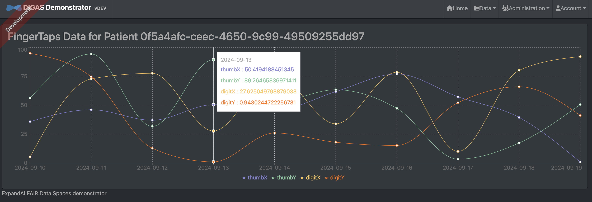

# ExpandAI demonstrator

<a href="https://www.expandai.de" target="_blank"> www.expandai.de</a>

## Demonstrator overview
The goal of this demonstrator is a secure and legally compliant method to collect and manage data from various wearable sensor sources (e.g. smartphone and smartwatch), which can then be used to train AI algorithms. The prototype focuses on integrating AI-based DiGAs into the healthcare ecosystem by adhering to the FAIR (Findability, Accessibility, Interoperability, and Reusability) and Gaia-X principles. These guidelines ensure that data management is transparent, accessible, and fair. The ability to gather and analyze data about health conditions and influencing factors is crucial for developing new therapies and holistic care strategies.

At the core of this project is a data integration center, which gathers and standardizes Parkinson patient data from a smartphone (iPhone 12 Pro Max) and smartwatch (Apple Watch Series 8). AI analytics within the center enable near real-time data insights, supporting Parkinson healthcare professionals and researchers in decision-making and advancing medical research. Our prototype proposes a framework for secure data exchange between scientific institutions and industry partners. This collaboration can empower healthcare providers to monitor Parkinson patient health using a simple traffic light system to indicate their condition: green for well, yellow for unwell but not critical, and red for emergencies. This system will be accessible via a web platform for doctors, providing valuable insights while minimizing data sharing. Moreover, limited access to these databases for companies developing DiGAs could enhance AI model training and product development, ultimately advancing personalized healthcare and improving patient outcomes.

## Dashboard

The dashboard provides a clear, organized interface for displaying both results and finger-tap data, offering insights
into patient motor performance.
The use of visual elements like charts and traffic lights effectively communicates the data trends and potential areas
of concern. The chart highlights key metrics, thumb and digit movements over time, allowing users to track progress or
deterioration. The traffic light system adds a simple yet powerful tool for quick assessments, signaling performance
status with an intuitive red-yellow-green scheme.

## Technologies used
The FAIR data space enables information exchange between research and industry organizations.

- Java
- Spring Boot
- React
- Gaia-x standards
- Docker Containers
- Github
- REST and OpenAPI 

